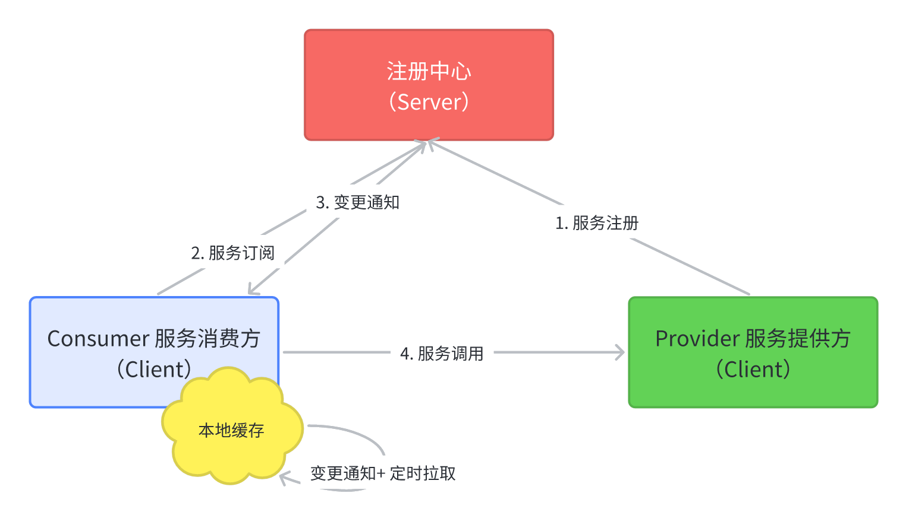

# customer-system-platform

## 客服系统平台

### 核心模块说明

|                 模块名                 |                   描述                   |
| :------------------------------------: | :--------------------------------------: |
|       customer-system-dependency       |               统一依赖管理               |
|          customer-system-sdk           |   SDK 依赖包，包含领域对象和服务的定义   |
|            customer-service            | 客服核心服务，用于实现客服平台的核心功能 |
|          integration-service           |   集成服务，用于实现外包客服系统的集成   |
|           outsourcing-system           |               外包客服系统               |
|      customer-system-admin-server      |         Spring Boot Admin 管控台         |
|         customer-system-theory         |            一些补充的理论基础            |
| customer-system-infrastructure-utility |              基础设施工具类              |

### 客服平台顶层用例

### 客服平台 EIP 集成架构模式

### 客服平台 EIP 组件交互流程

### RPC 整体架构

### 注册中心的基本模型

