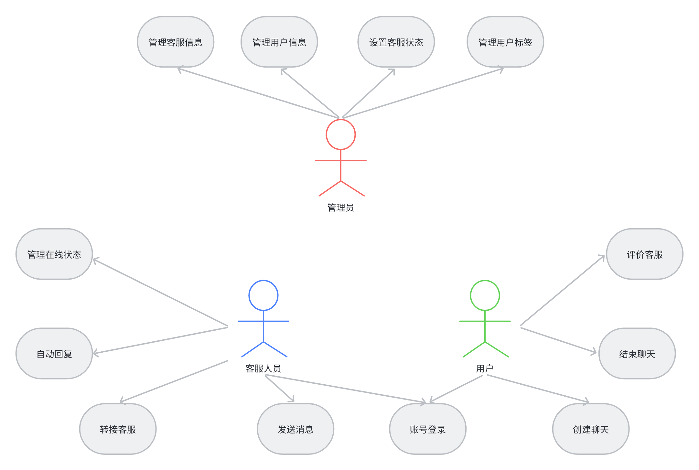
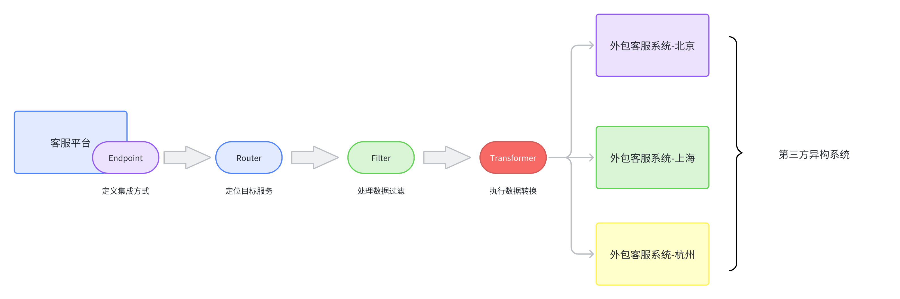
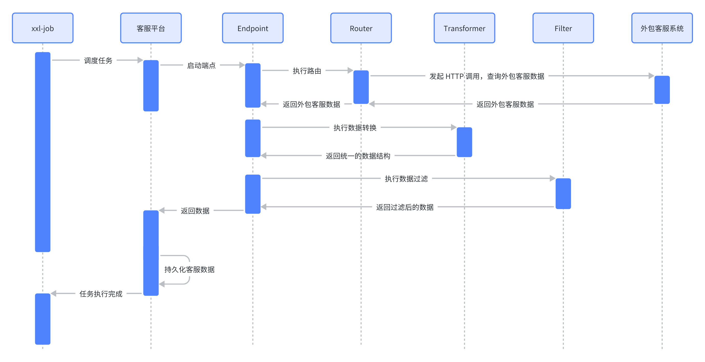
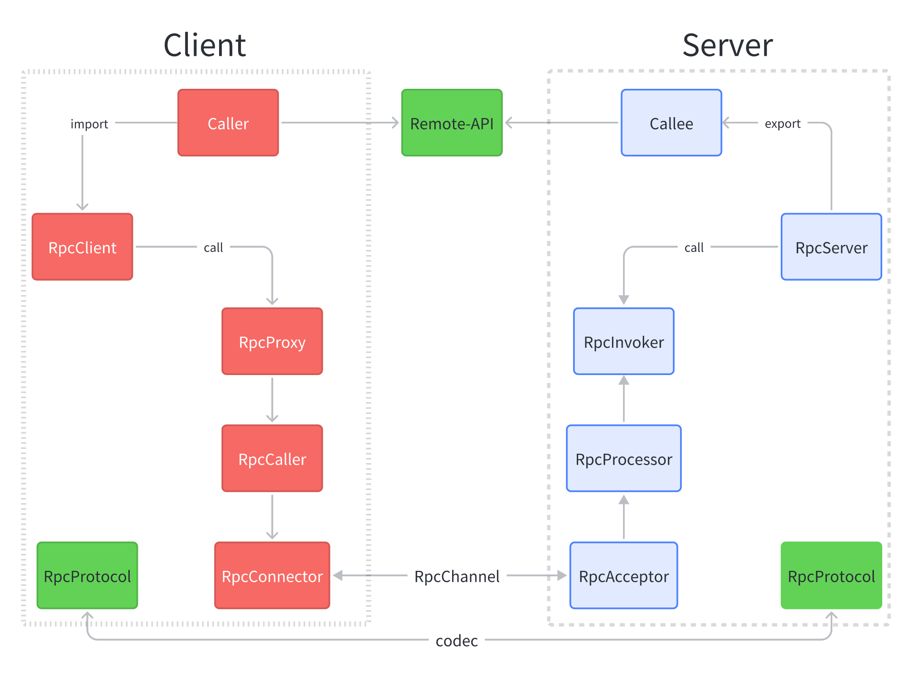

# customer-system-platform

## 客服系统平台

### 核心模块说明

| 模块名                    | 描述                     |
| ------------------------- | ------------------------ |
| cs-dependency             | 统一依赖管理             |
| cs-infrastructure-utility | 基础设施工具类           |
| customer-service          | 客服核心服务             |
| integration-service       | 集成服务                 |
| outsouring-system         | 外包客服系统             |
| cs-admin-server           | Spring Boot Admin 管控台 |
| customer-system-theory    | 一些补充的理论基础       |

### 客服平台顶层用例

### 客服平台 EIP 集成架构模式

### 客服平台 EIP 组件交互流程

### RPC 整体架构

